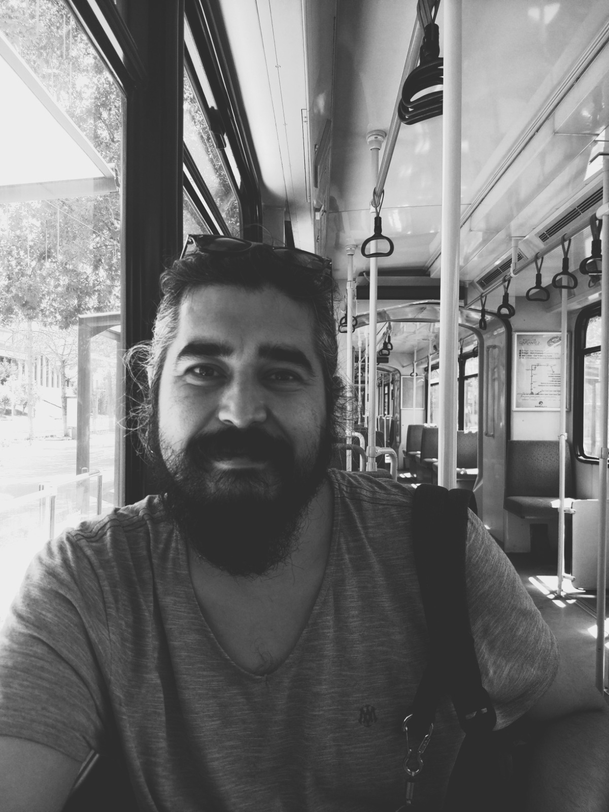

  

I'm a research assistant at [Institute for Migration, Gaziantep University, Gaziantep, Turkey](http://goc.gantep.edu.tr).
My **research interests** are:

* [City and urbanization]{.highlight-color}
* [Mobiltiy and housing]{.highlight-color}
* [R and QGIS applications]{.highlight-color}
* [Forced migration]{.highlight-color} and [Urban refugees]{.highlight-color}

I speak **Turkish** (native), **English** (fluenty) and **R** (still too much to learn). I've lived in Antalya, Turkey until I was 18 and left for university. My first major was Molecular Biology and Genetics at Boğaziçi University, dropped it out for studying Early Childhood Education at the same university. I worked as early childhood teacher in Gaziantep for 5 years after my graduation. Then, I started to work as a research assistant at Gaziantep University Institute for Migration and obtained M.A. degree from Urban Studies at Gaziantep University in 2021. I wrote a thesis on [Residential Mobility of Syrians Living in Gaziantep] using a dataset which was created by me and my colleagues / professors. I used **R** and **QGIS** for analysis. I play bass guitar (at home alone most of the time), I'm learning **statistics**, **R language**, and **map-making**. 

I live with my lovely wife and three cat friends in Gaziantep.

